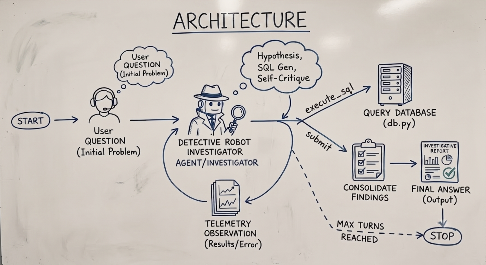

# DFIR-Agent



An autonomous Digital Forensics and Incident Response (DFIR) AI Investigator. DFIR-Agent uses Large Language Models (powered by Groq) to autonomously hunt through raw telemetry data, formulate hypotheses, execute SQL queries against an evidence database, and discover attack chains organically.

## Features

- **Autonomous Threat Hunting**: Employs an iterative loop where the agent forms hypotheses, runs SQL queries against logs, evaluates observations, and self-corrects based on the findings.
- **Simulated Telemetry Database**: Comes equipped with comprehensive simulated datasets including sign-in logs, alert evidence, email events, inbox rules, calendar events, file access logs, and more.
- **Automated Reporting**: Automatically generates professional DFIR Incident Response Reports summarizing the executive summary, attack timeline, compromised entities, and exfiltrated data.
- **Anti-Memorization (Anonymization) Testing**: Tests the agent's logical reasoning and generalization by regenerating anonymized environments. This ensures the agent uses sound forensic methodology rather than simply memorizing the baseline data.
- **Scoring & Evaluation System**: Evaluates the agent's final answer and step-by-step investigation path against a ground truth solution, providing a discounted reward score to measure performance.

## Architecture

The agent acts as an autonomous loop that interacts with an SQLite telemetry database:
1. **Thought & Hypothesis**: The agent formulates a theory about the incident.
2. **Action (`execute_sql`)**: Queries the simulated environment (`simulated_db.db`) using SQL.
3. **Observation**: Ingests query results and logs them.
4. **Self-Critique**: Adjusts queries if they fail or yield no results.
5. **Action (`submit`)**: Submits the final findings and triggers automated report generation.

## Project Structure

- `main.py`: Entry point for running the environment tests, regenerating the anonymized database, and orchestrating the evaluation flow.
- `agent.py`: Core agent logic, system prompts, LLM integration via the Groq API, and the ReAct-style investigation loop.
- `db.py`: Database engine setup and safe SQL execution using SQLite and Pandas.
- `data.py`: Mock data definitions and DataFrames containing the simulated telemetry logs.
- `regenerate.py`: Robust anonymization functions that replace specific user data, IPs, and SIDs with randomized identifiers to generate novel test environments.
- `scorer.py`: Contains the reward function that evaluates the transcript and final answer against a predefined ground truth solution path.

## Setup & Installation

1. **Clone the repository:**
   ```bash
   git clone <repository-url>
   cd DFIR-Agent
   ```

2. **Install dependencies:**
   Make sure you have Python 3.8+ installed, then run:
   ```bash
   pip install -r requirements.txt
   ```

3. **Set up Environment Variables:**
   Create a `.env` file in the root directory and add your Groq API key:
   ```env
   GROQ_API_KEY=your_groq_api_key_here
   ```

## Usage

To start the autonomous investigation and evaluation:

```bash
python main.py
```

**Execution Flow:**
1. Runs the baseline environment test on the original telemetry dataset.
2. Outputs execution logs and intermediate agent reasoning to the console and `log.txt`.
3. Generates the initial DFIR report (`report.txt`).
4. Automatically anonymizes the telemetry data and updates the SQLite database.
5. Reruns the investigation on the newly anonymized environment.
6. Generates the anonymized DFIR report (`report_anonymized.txt`).
7. Logs the evaluation scores for both the original and anonymized runs.

## Investigation Methodology

The prompt given to the AI enforces the following methodology:
- **Hypothesis-Driven**: The agent must outline its thought process before attempting a query.
- **Exploratory Analysis**: No blind assumptions allowed; the agent is instructed to explore the schema and data shape (using `LIMIT`, `DISTINCT`, etc.).
- **Self-Correction**: If a query returns an error or 0 rows, the agent is trained to analyze the failure, criticize its assumptions, and pivot.
- **Evidence Chaining**: Every compromised IP, SID, or User Principal Name discovered acts as a pivot point for the next step in the investigation.